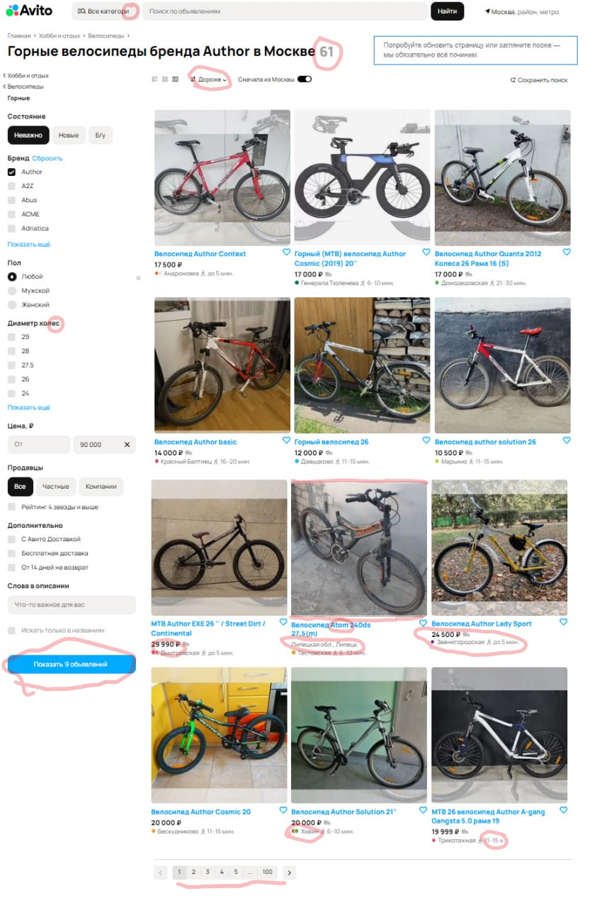

## В данном файле представлены найденные баги на скриншоте страницы Авито. 

| ID  | Описание бага | Ожидаемый результат | Фактический результат | Приоритет |
|----|--------------|---------------------|----------------------|-----------|
| BUG-1 | Сортировка по цене не работает | Товары должны сортироваться строго по возрастанию или убыванию цены | Объявления отображаются в неправильном порядке (дешевые товары могут идти перед дорогими) | High |
| BUG-2 | Фильтр "Сначала из Москвы" работает некорректно | Должны отображаться только объявления из Москвы | В списке появляются объявления из других регионов (Липецк, Санкт-Петербург) | High |
| BUG-3 | Несоответствие количества объявлений | Данные о количестве объявлений должны быть согласованы | В заголовке указано 61 объявление, "показать" предлагает 9, на первой странице 12, а страниц 100 | High |
| BUG-4 | В выдаче показан товар с другим брендом | Должны отображаться только товары бренда Author | Среди велосипедов Author показан велосипед Atom | Medium |
| BUG-5 | Опечатка в названии категории | Должно быть "все категории" | Написано "все категори" вместо "все категории" | Medium |
| BUG-6 | Опечатка в названии станции метро | Название станции должно быть корректным | Написано "Ховин", должно быть "Ховрино" | Low |
| BUG-7 | Ошибка в удаленности от метро Трикотажная | Корректное расстояние от метро | Неправильное значение расстояния (11 часов) | Low |
| BUG-8 | Опечатка в слове "колес" | Должно быть "колёс" | Написано "колес" вместо "колёс" | Low |

